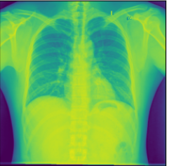
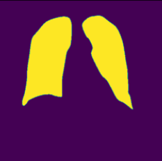
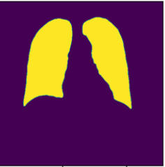
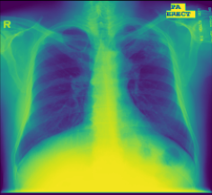
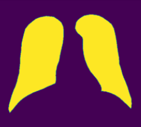
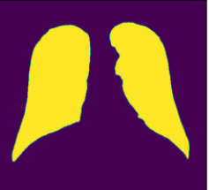

# U-Net Implementation

The convolutional network using U-Net architecture is implemented in this project, for a Lung X-ray dataset with masks(ground truth) and its respective x-ray iamges. The results on the test dataset is elaborated below.

The implementation was done on Google colab. Images were downloaded on to google drive and subsequently used in the notebook. 

Refer  ``` training_code.ipynb``` for codes related to training the model, and plotting results, ```dataloader.py``` for data preprocessing steps, ```modelDCGAN.py``` for U-net classes and its architecture.


Refer  ```training_code.ipynb``` for the training code used in the notebook (.ipynb extension) file.

Refer ```training_code.py``` for the training code (.py extension) file.

All code in this reposiroty is based on PEP-8 standards(Important for contributing to the repo).

## Install Requirements:
For installing the requirements for this software, please run the following: 

 ```
 pip install -r requirements.txt
 ```
  
## Results:

Some of the results are shown below, comparing the ground truth masks to the predicted masks for same X-Ray images in the test dataset.

Final results on the test set: Dice-coefficient: 0.9604 , Binary Accuracy: 0.9788 ,IoU(Intersection over Union): 0.9239

| X-ray Image  | Actual Mask  | Predicted Mask |
| ------------ | ------------ | ---------------|
| |  ||
| | | |

## Dataset
https://www.kaggle.com/datasets/nikhilpandey360/chest-xray-masks-and-labels/data